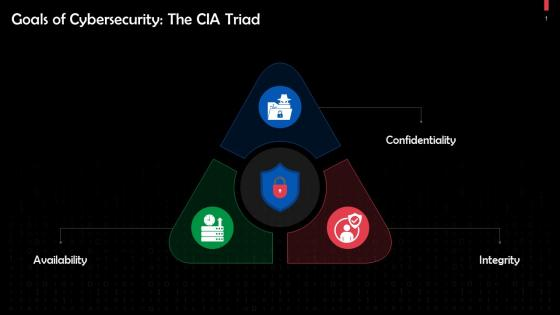

# Introduction to Data Privacy

## Topics

- Data Privacy
- Importance of Data Privacy
- Differences Between Data Privacy, Security, and Protection
- Fundamental Privacy Principles

## Data Privacy

- **_Data privacy_**, also known as <ins>**_"information privacy"_**</ins>, refers to the rights and expectations of individuals to control how their personal information is collected, used, and shared
- Ensuring data privacy helps maintain trust between individuals and organization, supports compliance with legal regulations, and upholds ethical standards in data handling

## Importance of Data Privacy

- Protects Personal Information

  - Persoanl data includes sensitive information such as <ins>**_names_**</ins>, <ins>**_addresses_**</ins>, <ins>**_financial details_**</ins>, <ins>**_medical records_**</ins>, and <ins>**_online activities_**</ins>
  - **Examples**\
 A data breach at bank can expose customer financial information leading to <ins>**_fraudulent transactions_**</ins>

## Ensures Compliance with Laws and Regulations

- Governments and regulatory bodies inforce data privacy laws to protect individuals' rights
- Organizations must comply with laws like:

  - <ins>**_GDPR (General Data Protection Regulation)_**</ins> - EU law protecting user data.
  - <ins>**_CCPA (California Consumer Privacy Act)_**</ins> - Protects California residents' personal information
  - <ins>**_HIPPA (Health Insurance Protability and Accountability)_**</ins> - Safegaurds medical records in the U.S.

## Builds Trust Between Business and Consumers

- Prioritize data privacy to gain customer trust and loyalty
- Customers are more likey to do businesss with companies that respect their privacy and handle data responsibly
- Example:\
A social media platform that transparently explains how user data is used will attract more trust compared to one involved in data scandals

## Prevents Data Breaches and Cyberattacks

- Strong <ins>data privacy polices</ins> help protect agains <ins>**_hacking_**</ins>, <ins>**_phising_**</ins>, and <ins>**_ransomware_**</ins>
- <ins>**Cybercriminals**</ins> exploit weak data protetction to steal and sell personal information on the dark web
- Example:\
In 2021, a major data breach at Facebook exposed <ins>**_533 million users_**</ins> personal data, which was later found on hacker forums

## Protects Freedom and Prevents Discrimination

- Miuse of personal data can lead to discrimination based on <ins>**_race_**</ins>, <ins>**_gender_**</ins>, <ins>**_health status_**</ins>, or <ins>**_financial history_**</ins>
- Data privacy helps prevent <ins>**_mass surveillance_**</ins>, <ins>**_government overreach_**</ins>, and <ins>**_unauthorized tracking of individuals_**</ins>
- Examples:\
Employers using AI-powered hiring system must ensure personal data isn't used unfairly in hiring decisions

 
 
 

# Data Security

Data security refers to the <ins>**_techinical measures_**</ins> and <ins>**_practices_**</ins> used to protect data from <ins>**_unauthorized access_**</ins>, <ins>**_breaches_**</ins>, <ins>**_theft_**</ins>, or <ins>**_corruption_**</ins>. It ensures that sensitive information remains <ins>**_condidential_**</ins>, <ins>**_intact_**</ins>, and <ins>**_available only to authorized indivuals_**</ins>

## Types of Data Security

- <ins>**_Encryption_**</ins>\
&emsp;Is the use of algorithms to scramble data and hide its true meaning
- <ins>**_Data Erasure_**</ins>\
&emsp;Is <ins>**_the process of securely deleting data_**</ins> so that can cannot be recoverd
- <ins>**_Data Masking_**</ins>\
&emsp;Is a technique used to <ins>**_hide real data_**</ins> by replacing it with fictitous but realistic data
- <ins>**_Data Resiliency_**</ins>\
&emsp;Refers to <ins>**_the ability of a system to recover quickly and maintain availability_**</ins> after a disruption, cuperattack, or hardware failure

# Data Protection

Data protection refers to set of <ins>**_pratices_**</ins>, <ins>**_policies_**</ins> and <ins>**_technologies_**</ins> aimed at safeguarding data from <ins>**_loss_**</ins>, <ins>**_corruption_**</ins>, <ins>**_theft_**</ins>, or <ins>**_unauthorized access_**</ins>. It ensures that data remains secure, accurate, and accessible while upholding privacy standards

## The CIA Triad

1. <ins>**_Confidentiality_**</ins>\
&emsp;Ensures that sensitive information is accessed only by an authorized person
2. <ins>**_Integrity_**</ins>\
&emsp;Ensures that the information is true and correct to its original purpose
3. <ins>**_Availability_**</ins>\
&emsp;Ensures that information and resources are available to those who need them

Data protection is vital for <ins>**_regulatory compliance_**</ins>, ensuring organization follow the gloval data privacy laws like <ins>**_GDPR_**</ins>, <ins>**_CCPA_**</ins>, and <ins>**_Data Privacy Act_**</ins> to safeguard sensitive information

# Fundamental Privacy Principles

Serve as the foundation for data protection laws and organizational policies to ensure individuals' personal data is handled responsibly

## Privacy Principles

- <ins>**_Transparency_**</ins>
- <ins>**_Purpose Minimization_**</ins>
- <ins>**_Accuracy_**</ins>
- <ins>**_Storage Limitation_**</ins>
- <ins>**_Integrity and Confidentiality(Security)_**</ins>
- <ins>**_Accountability_**</ins>

### Transparency

- Organization must inform individuals about how their data is <ins>**_collected_**</ins>, <ins>**_used_**</ins>, <ins>**_shared_**</ins>, and <ins>**_stored_**</ins>
- Example:\
&emsp;Privacy polocies on website detailing data practices

### Purpose Limitation

- Personel data should only be collected for <ins>**_specific_**</ins>, <ins>**_clear_**</ins>, and <ins>**_lagitimate purposes_**</ins>
- Examples:\
&emsp;A company should not use customer data for advertising if it was collected for accound verification

### Data Minimization

- Organization should only collect the minimum amound of personal data necessary for a specific purpose
- Example:\
&emsp;A mobile app requiring only an email, not a full address, for account creation

### Accuracy

- Personal data must be kept <ins>**_accurate_**</ins>, <ins>**_up-to-date_**</ins>, and <ins>**_corrected_**</ins> when necessary
- Example:\
&emsp;Banks allowing customers to update personal details to prevent errors

### Storage Limitation

- Personal data should not be retained longer than necessary for its intended purpose
- Example:\
&emsp;A business deleting inactive customer accounts after a set period

### Integrity and Confidentiality (Security)

- Oragnization must protect data against <ins>**_unauthorized access_**</ins>, <ins>**_breaching_**</ins>, or <ins>**_loss using strong security measures_**</ins>
- Examples:\
&emsp;Encryption, firewalls, and access controls for sensitive financial data

### Accountability

- Companies and Organizations must be responsible for complying with privacy laws and demontrating their adherence
- Examples:\
&emsp;Appointing a <ins>**_Data Protection Officer (DPO)_**</ins> to oversee complaince with privacy laws

 
 
 
 
 
 

# Legal and Regulatory Frameworks

- <ins>**_General Data Protection Regultory (GDPR)_**</ins> - European Union
- <ins>**_California Consumer Privacy Act (CCPA)_**</ins> - United States (California)
- <ins>**_Data Privacy Act of 2012 (Republic Act 101073)_**</ins>

## General Data Protection Regulatoin (GDOR) - European Union

- Is the toughest privacy and security law in the world
- It imposes obligation onto organizations anywhere, so long as they target or collect data related to people in the EU
- The regulation was put into effect on <ins>**_May 25, 2018_**</ins>
- The GDPR will levy harsh fines against those who violate its privacy and security standards, with penalties reaching into the <ins>**_tens of millions of euros_**</ins>

### Key Principles of GDPR

- Requires clear user consent before collecting data (like name, email address, location information, ethnicity, gender, biometric data, web cookies)
- Grants users the <ins>**_"Right to be Forgotten"_**</ins> (deleting their data upon request)
- Data breaches notification must be sent within 72 hours
- Enforces strict penalties for violations <ins>**_(up to €20 million or 4% of annual revenue)_**</ins>
&emsp;Meta(Facebook) was fined <ins>**_€1.2 billion_**</ins> for transferring EU user data to the U.S. without proper safeguards

## California Consumer Privacy Act(CCOA) - United States (California)

- The California Privacy Act of 2018 (CCPA) gives consumers more control over the personal information that business collect about them

### Privacy Rights for Consumers

- The right to know what data is collected and how it is used
- The right to <ins>**_op-out of data sales_**</ins> or <ins>**_sharing of their personal information_**</ins> 
- The right to request deletion of personal information
- The right to non-discrimination for exercising their CCPA rights
- On <ins>**_January 1, 2023_**</ins>, the CCPA added an additional privacy protection, granting new consumer rights to privacy

  - THe right to correct inaccurate personal information that a business has about them
  - The right to limit the use of disclosure of sensitive personal information collected about them
  
- Example Violation:\
&emsp;Sephore was fined <ins>**_€1.2 million in 2022_**</ins> failing to disclose data tracking and not allowing customers to opt-out of data sales

## Data Privacy Act of 2012 (Republic Act 10173) - Philippines

- Is a Philippine law designed to protect the privacy of individuals by regulating how personal data is <ins>**_collected_**</ins>, <ins>**_stored_**</ins>, and <ins>**_processed_**</ins> by both government and private entities, ensuring the secure handling of personal information within information and communicate systems across the country
- Establishes the <ins>**_National Privacy Commision (NPC)_**</ins> to oversee its implimentation

  ### <ins>**_National Privacy Commision (NPC)_**</ins>

  - The <ins>**_National Privacy Commision_**</ins>, or <ins>**_NPC_**</ins>, is an independent government body in the Philippines created under <ins>**_Rebuplic Act No. 10173_**</ins> or the <ins>**_Data Privacy Act of 2012_**</ins>
  - The Commission is mandated to administer and implement the provision of the Act and to monitor and ensure compliance of the country with international standards set for data protection

- Applies to any organization processing peronal data of Philippin citizen
- Ket Features:

  - Requires <ins>**_Data Protection Officers (DPO's)_**</ins> in organization
  - Consumers have the right to <ins>**_access_**</ins>, <ins>**_correct_**</ins>, and <ins>**_delete_**</ins> their personal data
  - Imposes penalties on businesses that misuse or fail to protect personal data

- Example Violation:\
&emsp;<ins>**_COMELEC Data Breach (2016)_**</ins> - <ins>**_The Philippine Commission on Elections_**</ins> suffered a massive voter data leak, exposing <ins>**_55 million records_**</ins>

## Why Are These Laws Important?

- Protects consumer rights and ensures data is handled responsibly
- Ecnourages companies to implement stronger security measures
- Reduces <ins>**_identiy theft_**</ins>, <ins>**_fraud_**</ins>, and <ins>**_unauthorized data use_**</ins>, holds organization accountable for data misuse